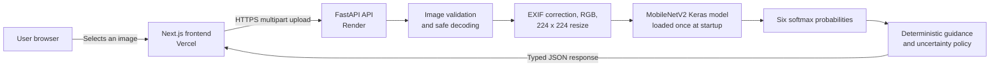

# EcoSort AI

**Scan. Sort. Recycle Smarter.**

EcoSort AI is a B.Tech Deep Learning project that classifies a photograph of one waste item as **cardboard, glass, metal, paper, plastic, or trash**. A FastAPI service runs the real trained MobileNetV2 model, and a Next.js interface presents the predicted class, confidence, three most likely classes, and deterministic recycling or disposal guidance.

The classifier performs visual recognition, not material or chemical analysis. Its advice is general educational guidance; local recycling rules remain authoritative.

## Live demo

- GitHub: [https://github.com/sathwiknagavelli9/ecosort-ai](https://github.com/sathwiknagavelli9/ecosort-ai)
- Frontend: [https://ecosort-ai-tan.vercel.app](https://ecosort-ai-tan.vercel.app)
- Backend API: [https://ecosort-ai-api.onrender.com](https://ecosort-ai-api.onrender.com)
- Health: [https://ecosort-ai-api.onrender.com/health](https://ecosort-ai-api.onrender.com/health)
- Model info: [https://ecosort-ai-api.onrender.com/model-info](https://ecosort-ai-api.onrender.com/model-info)

The public API and a real browser-to-model prediction flow were verified after deployment.

## Architecture



The application does not require a database or user accounts. Uploads are processed transiently for the current request and are not retained by application code.

See [docs/architecture.md](docs/architecture.md) for the request flow, API boundaries, security controls, and deployment topology.

## Features

- Real inference from the trained `ecosort_mobilenetv2.keras` artifact
- Drag-and-drop, file-picker, and supported mobile-camera input
- Image preview before the user explicitly starts classification
- Predicted category, confidence, low-confidence warning, and descending top three
- Deterministic class-specific recycling and disposal guidance
- Clear cold-start, timeout, invalid-file, and service-unavailable states
- Responsive, keyboard-accessible interface
- Model-performance, limitations, and responsible-use information
- No generated fallback, random result, or LLM-based classification

## Supported categories

| Category | General guidance |
| --- | --- |
| Cardboard | Commonly recyclable when clean and dry. Flatten where appropriate; food-contaminated material may need different disposal. |
| Glass | Many glass containers are recyclable. Empty or rinse them where practical; broken glass may need special handling. |
| Metal | Many cans and metal containers are recyclable. Empty and lightly clean them where appropriate. |
| Paper | Commonly recyclable when clean and dry. Heavily soiled or coated paper may not be accepted. |
| Plastic | Acceptance varies by resin type and local facilities. Check the marking and local policy; not all plastic is recyclable. |
| Trash | Covers miscellaneous material outside the five named material classes. Follow local municipal rules; this label does not mean hazardous waste. |

All guidance is intentionally general because recycling programs differ by location.

## Technology stack

| Layer | Technology |
| --- | --- |
| Frontend | Next.js, TypeScript, App Router |
| Backend API | Python, FastAPI, Uvicorn, Pillow, NumPy |
| ML runtime | TensorFlow/Keras, using the canonical `.keras` artifact directly |
| Model | MobileNetV2 transfer learning with an ImageNet-pretrained backbone |
| Frontend hosting | Vercel |
| Backend hosting | Render |
| Testing | Pytest/FastAPI tests plus frontend lint, type-check, and production build |

## Deep Learning model

The network accepts a `224 x 224 x 3` `float32` tensor. The serialized model contains a rescaling layer that maps raw pixel values from `[0, 255]` to `[-1, 1]` using `x / 127.5 - 1`. Its architecture is:

1. Training-only image augmentation
2. MobileNetV2 with ImageNet weights and `include_top=False`
3. Global average pooling
4. Dropout with rate `0.35`
5. Six-unit dense softmax output

The class-index order is read from `backend/models/class_names.json`:

```text
0 cardboard
1 glass
2 metal
3 paper
4 plastic
5 trash
```

### Data preprocessing

The training notebook and production path share the same model-facing input contract. Production additionally corrects EXIF orientation as a safeguard for phone photographs:

1. Decode the image to exactly three channels (`tf.io.decode_image(..., channels=3)` in the notebook).
2. For production uploads, correct EXIF orientation, then convert to RGB.
3. Resize to `224 x 224` with TensorFlow bilinear interpolation and antialiasing.
4. Convert to `float32`, retaining raw values in `[0, 255]`.
5. Add a batch dimension.
6. Let the model's embedded rescaling layer map values to `[-1, 1]`.

Augmentation is active only during training: horizontal random flip, rotation `0.05`, translation `0.05`, zoom `0.10`, and contrast `0.10`. It is never applied to uploaded images at inference time.

## Dataset and leakage-safe split

The project uses the resized TrashNet dataset. The source archive contained 2,527 images. A quality audit quarantined six images involved in three exact cross-label duplicate groups, leaving 2,521 usable images. No corrupt images were found.

Duplicate groups were kept together through a nested `StratifiedGroupKFold` split to reduce train/validation/test leakage:

| Split | Images |
| --- | ---: |
| Training | 1,800 |
| Validation | 360 |
| Test | 361 |

The training set is imbalanced: the usable dataset has 137 `trash` images compared with 594 `paper` images. Class weights were therefore used during training.

## Transfer learning and training

Training took place in two stages:

1. **Feature extraction:** the MobileNetV2 backbone was frozen for 25 completed epochs at learning rate `1e-3`.
2. **Fine-tuning:** the last 40 backbone layers were eligible for training for 12 completed epochs at learning rate `1e-5`; batch-normalization layers remained frozen.

The fine-tuned candidate was selected because it had the lower validation loss, with validation accuracy used only as a tie-breaker. The held-out test set was not used for model selection. This is transfer learning, not a network trained from scratch.

## Model evaluation

The saved `backend/models/model_metrics.json` is the source of truth.

| Metric | Exact value | Display value |
| --- | ---: | ---: |
| Test accuracy | `0.850415512465374` | 85.04% |
| Macro precision | `0.8256227190345299` | 82.56% |
| Macro recall | `0.8280514797222903` | 82.81% |
| Macro F1 | `0.8259942272207406` | 82.60% |
| Weighted F1 | `0.8493687824131492` | 84.94% |
| Test samples | `361` | 361 |

| Class | Precision | Recall | F1 | Test support |
| --- | ---: | ---: | ---: | ---: |
| Cardboard | 94.74% | 93.10% | 93.91% | 58 |
| Glass | 80.30% | 74.65% | 77.37% | 71 |
| Metal | 82.09% | 93.22% | 87.30% | 59 |
| Paper | 92.94% | 94.05% | 93.49% | 84 |
| Plastic | 80.30% | 76.81% | 78.52% | 69 |
| Trash | 65.00% | 65.00% | 65.00% | 20 |

The model achieved about 85% accuracy on the held-out TrashNet test set. Real-world performance may differ because lighting, backgrounds, object condition, camera angle, and mixed materials may differ from the dataset. The `trash` test subset contained only 20 images and produced the weakest F1 score, so its result should be interpreted cautiously.

See [docs/model.md](docs/model.md) for the full training, selection, preprocessing, confusion-matrix, and limitation notes.

## API endpoints

| Method | Path | Purpose |
| --- | --- | --- |
| `GET` | `/` | Service identity |
| `GET` | `/health` | Service and model-load health |
| `GET` | `/model-info` | Classes, architecture, and saved evaluation metadata |
| `POST` | `/predict` | Validate an uploaded image and run real inference |

Upload an image with multipart field `file`:

```bash
curl -X POST "http://localhost:8000/predict" \
  -H "accept: application/json" \
  -F "file=@sample.jpg"
```

The prediction response contains a predicted class and confidence, three sorted class probabilities, an uncertainty flag, and deterministic guidance. Confidence values are probabilities emitted by the model, not guarantees of correctness.

The operational low-confidence threshold is `0.60`. It is a product heuristic chosen to trigger cautious UI guidance; it is not a statistically calibrated probability threshold and does not create an additional `unknown` class.

The API accepts JPEG/JPG, PNG, and WEBP images up to **8 MiB**. It checks content as well as request metadata and rejects corrupt, oversized, unsupported, or excessively large images with a clean JSON error.

## Project structure

```text
ecosort-ai/
├── backend/
│   ├── app/                 # FastAPI, inference, schemas, recommendations
│   ├── models/              # Canonical model, class map, exact metrics
│   ├── tests/               # API, validation, and inference tests
│   └── requirements.txt
├── frontend/
│   ├── app/                 # Next.js App Router pages
│   ├── components/          # Upload, result, and information UI
│   ├── lib/                 # API types/client and static model metadata
│   └── public/
├── training/
│   └── EcoSort_Training.ipynb
├── docs/
│   ├── architecture.md
│   ├── model.md
│   └── viva.md
└── README.md
```

## Local development

### Backend

Training was recorded with Python 3.13.15 and TensorFlow 2.20.0. Serving is tested and pinned to Python 3.11.11 with TensorFlow CPU 2.20.0; this does not change or retrain the artifact.

```powershell
cd backend
py -3.11 -m venv .venv
.\.venv\Scripts\Activate.ps1
python -m pip install --upgrade pip
python -m pip install -r requirements-dev.txt
python -m uvicorn app.main:app --reload --port 8000
```

The API is then available at `http://localhost:8000`.

### Frontend

```powershell
cd frontend
npm install
Copy-Item .env.example .env.local
npm run dev
```

Open `http://localhost:3000`.

## Environment variables

Frontend development (`frontend/.env.local`):

```dotenv
NEXT_PUBLIC_API_BASE_URL=http://localhost:8000
```

Backend development can allow the local frontend with:

```dotenv
ALLOWED_ORIGINS=http://localhost:3000
```

`ALLOWED_ORIGINS` accepts a comma-separated list. When configured, it replaces the built-in local-development defaults; `FRONTEND_ORIGIN` remains a single-origin compatibility alias. Production uses only the canonical Vercel origin and rejects wildcards. Never commit `.env` files.

## Testing

Run backend tests without depending on cloud services:

```powershell
cd backend
python -m pytest
```

The backend suite should cover service metadata, health, model information, valid JPEG/PNG/WEBP inference, content validation, corrupt and oversized input, class order, six-value output, confidence range, top-three sorting, recommendations, low-confidence behavior, and clean errors.

Run frontend quality gates:

```powershell
cd frontend
npm run lint
npm run typecheck
npm run build
```

For an end-to-end smoke test, run both services, classify a genuine waste photograph, verify that the browser shows the real API result and guidance, and then classify another image without refreshing the page. A blank or generated solid-color image does not demonstrate classifier quality.

## Deployment architecture

### Render backend

- Blueprint: root [`render.yaml`](render.yaml), validated with the Render CLI.
- Service root: `backend`; runtime: Python `3.11.11` from `.python-version`; plan: free.
- Build: `python -m pip install --upgrade pip && python -m pip install -r requirements.txt`.
- Start: `python -m uvicorn app.main:app --host 0.0.0.0 --port $PORT --workers 1`.
- Health-check path: `/health`.
- `ALLOWED_ORIGINS` is the canonical Vercel origin. One worker prevents duplicate TensorFlow model copies.
- `/health`, `/model-info`, and `/predict` were verified publicly with a real TrashNet image.

### Vercel frontend

- Deploy `frontend` as the project root.
- Set `NEXT_PUBLIC_API_BASE_URL` to the verified Render service origin.
- Run a production build before and during deployment.
- After the canonical Vercel URL is known, finalize the Render CORS origin and verify the complete browser-to-model flow.

The UI accounts for possible Render cold starts and does not show artificial progress. No paid resource is required by the architecture, and no paid plan should be created without explicit approval.

## Limitations

- The model recognizes only the six listed classes.
- Mixed-material objects may not fit one class cleanly.
- Clutter, lighting, unusual angles, occlusion, dirt, and damage can change results.
- TrashNet is small and does not represent every real-world waste stream.
- The `trash` class is comparatively underrepresented and had the weakest test F1.
- A confidence score is not a guarantee or a calibrated likelihood of correctness.
- Recycling acceptance and disposal rules vary by locality.

## Responsible use

EcoSort AI is an educational classifier, not a legal or safety authority. Do not rely on it as the sole guide for batteries, chemicals, electronics, medical waste, hazardous waste, or other regulated material. Follow product labels and local municipal guidance. User images are intended to be processed transiently and are not required to be stored.

## Future improvements

- Collect a larger, more balanced, and more geographically varied dataset.
- Add carefully labelled classes for common e-waste and organic waste while keeping safety guidance explicit.
- Evaluate probability calibration and derive thresholds from a dedicated validation protocol.
- Test robustness across lighting, camera, background, and damaged-object conditions.
- Explore segmentation or multi-label classification for scenes containing multiple materials.
- Convert to TFLite or ONNX only if deployment constraints justify it, with probability and top-class parity tests against the canonical Keras model.

## Academic context

This repository is a final-year/B.Tech Deep Learning project. It openly uses MobileNetV2 transfer learning with ImageNet weights; it does not claim a novel CNN trained from scratch. Dataset preparation, leakage-aware splitting, class weighting, validation-based model selection, held-out testing, deployment, and responsible communication are part of the engineering contribution.

Short oral-exam answers are available in [docs/viva.md](docs/viva.md).
