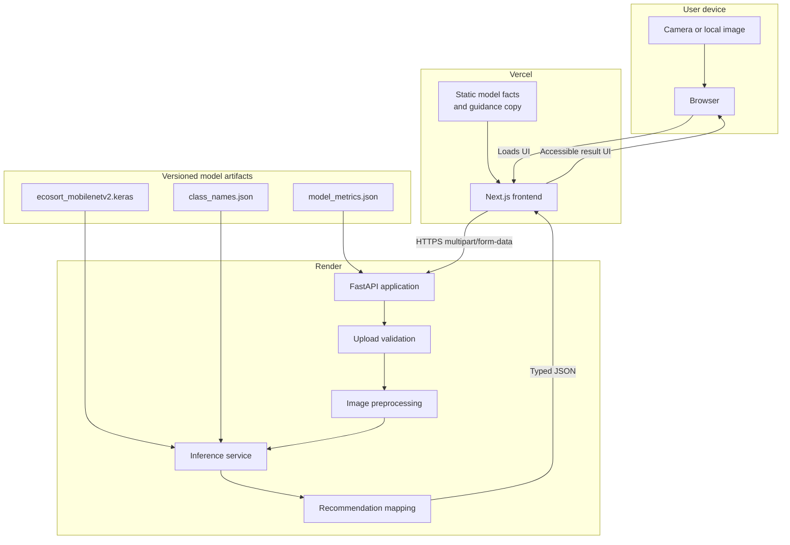
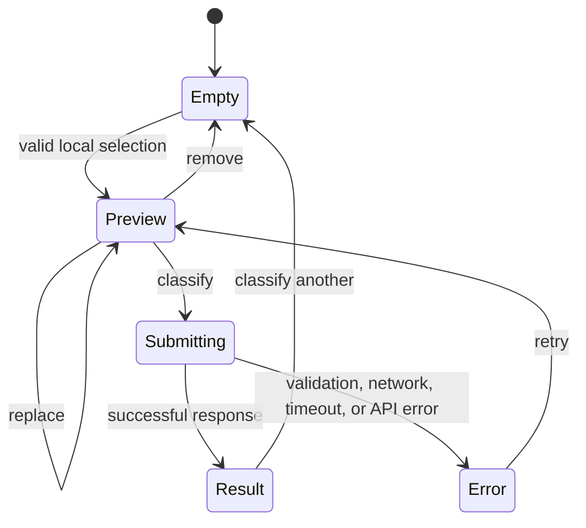

# EcoSort AI Architecture

## Purpose

EcoSort AI is a two-service educational application. A browser sends one user-selected waste photograph to a stateless FastAPI service. The API validates and preprocesses it, runs the canonical trained Keras model, and returns model probabilities plus deterministic disposal guidance. A Next.js frontend presents the result and the model's limitations.

The design deliberately has no database, account system, admin panel, queue, or generative-AI dependency. None is needed for single-image inference, and uploaded images should not be retained.

Verified production endpoints:

- Vercel frontend: [https://ecosort-ai-tan.vercel.app](https://ecosort-ai-tan.vercel.app)
- Render backend: [https://ecosort-ai-api.onrender.com](https://ecosort-ai-api.onrender.com)

## System context



## Deployment topology

| Component | Host | Responsibility |
| --- | --- | --- |
| Next.js frontend | Vercel | File selection and preview, API call, result display, static educational content |
| FastAPI backend | Render | Validation, preprocessing, real model inference, typed API response, deterministic recommendations |
| Keras model | Bundled with backend | Canonical trained classifier |
| JSON metadata | Bundled with backend; selected facts may also be copied to frontend at build time | Exact class order and evaluated metrics |

The browser calls Render directly over HTTPS. The Render service permits the canonical Vercel origin through an environment-configured CORS allowlist. Production must not depend on a localhost origin or a permissive wildcard.

## Frontend architecture

The frontend uses Next.js, TypeScript, and the App Router. Its central classifier behaves as a small state machine:



Important frontend boundaries:

- Selecting a file creates a local preview; it does not upload automatically.
- Only an explicit **Classify** action creates the multipart request.
- The classify action is disabled while a request is in flight.
- Camera input can use `capture="environment"` on supported mobile browsers.
- The loading state explains that a sleeping backend may take longer on its first request, without a fake countdown.
- Result components render the predicted class, confidence, uncertainty state, descending top three, and general guidance.
- Static model metrics and educational sections should remain readable even if the API is temporarily unavailable.
- Status changes should be announced accessibly, and upload controls must remain keyboard operable.

The public API origin comes from `NEXT_PUBLIC_API_BASE_URL`; deployment URLs are not embedded throughout components.

## Backend architecture

The backend is separated into focused responsibilities:

| Concern | Typical module responsibility |
| --- | --- |
| Application lifecycle | Construct FastAPI app, configure CORS, load model once, expose health |
| Configuration | Upload limit, allowed origins, model paths, confidence threshold |
| Schemas | Stable typed response and error shapes |
| Upload validation | Byte limit, supported format, safe Pillow decode, image dimensions |
| Inference | Training-matched preprocessing, synchronized model call, probability checks, top-k mapping |
| Recommendations | Deterministic guidance keyed only by the predicted class |

The canonical `ecosort_mobilenetv2.keras` model is loaded once during application startup. Reloading it for each request would add latency and memory pressure. A production process should begin with one worker because every additional process loads another TensorFlow model copy. Concurrency around the model call must be bounded or synchronized according to runtime behavior.

## Authoritative artifacts

| Artifact | Authority |
| --- | --- |
| `training/EcoSort_Training.ipynb` | Dataset preparation, preprocessing, augmentation, architecture, and training procedure |
| `backend/models/ecosort_mobilenetv2.keras` | Canonical learned weights and executable architecture |
| `backend/models/class_names.json` | Input contract, embedded preprocessing statement, and class-index order |
| `backend/models/model_metrics.json` | Dataset audit, split, training record, model selection, and exact test metrics |

If prose or copied values disagree with these artifacts, the artifacts win.

## Request flow

```mermaid
sequenceDiagram
    actor User
    participant UI as Next.js UI
    participant API as FastAPI
    participant Guard as Upload validator
    participant Model as Keras model
    participant Rules as Guidance mapping

    User->>UI: Select JPEG, PNG, or WEBP
    UI->>UI: Validate basic size/type and show local preview
    User->>UI: Click Classify
    UI->>API: POST /predict multipart field "file"
    API->>Guard: Stream/read with 8 MiB limit
    Guard->>Guard: Verify content, decode, check dimensions
    Guard-->>API: Safe RGB image
    API->>API: EXIF transpose; resize 224 x 224
    API->>Model: float32 batch with raw range 0..255
    Note over Model: Embedded rescaling: x / 127.5 - 1
    Model-->>API: Six softmax probabilities
    API->>API: Validate finite/range/order and select top three
    API->>Rules: Look up predicted-class guidance
    Rules-->>API: Recyclability/category/recommendation
    API-->>UI: Typed prediction response
    UI-->>User: Category, confidence, warning, top three, guidance
```

### Preprocessing contract

Inference must reproduce the non-augmented model-facing training contract. EXIF correction is an additional production safeguard rather than a notebook training transform:

1. Read and validate an encoded image.
2. Correct EXIF orientation for production uploads and convert to exactly three RGB channels; the notebook uses `tf.io.decode_image(..., channels=3)`.
3. Resize to `224 x 224` using TensorFlow bilinear interpolation with antialiasing.
4. Produce `float32` values in raw `[0, 255]` range.
5. Add the batch dimension.
6. Invoke the saved model, whose embedded `Rescaling` layer performs `x / 127.5 - 1`.

Training augmentation must not be applied in production inference.

### Output invariants

Before returning a prediction, the service should ensure:

- exactly six outputs exist;
- every value is finite and within a valid probability range;
- the saved model output is already softmax and is not normalized a second time;
- class index mapping comes from `class_names.json`;
- the primary class equals the probability argmax;
- the top three are sorted from highest to lowest confidence.

## API contract

### `GET /`

Returns a small service identity object, for example:

```json
{
  "name": "EcoSort AI API",
  "status": "ok"
}
```

### `GET /health`

Reports service readiness and whether the model loaded. It must not reveal local filesystem paths.

```json
{
  "status": "healthy",
  "model_loaded": true
}
```

### `GET /model-info`

Exposes non-sensitive facts derived from the checked-in metadata: architecture name, six classes in order, test metrics, test-set size, supported category count, and inference threshold.

### `POST /predict`

Accepts `multipart/form-data` with image field `file`. A successful response contains these concepts:

```text
prediction
  class           one of cardboard, glass, metal, paper, plastic, trash
  display_name    human-readable label
  confidence      numeric softmax value in [0, 1]
top_predictions   three entries sorted by confidence descending
uncertain         true when maximum confidence is below 0.60
recycling
  recyclable      cautious class-based boolean or status
  category        suggested general waste stream
  recommendation  deterministic advice
  local_rules_note
```

The `0.60` threshold is an operational heuristic, not a calibrated guarantee. A low-confidence response still returns the model's top class and advises the user to try a clearer image with one centered object. The system does not invent a seventh `unknown` class.

## Upload safety and privacy

The API supports JPEG/JPG, PNG, and WEBP with a maximum encoded upload size of **8 MiB**. Validation should cover:

- request and detected content type;
- successful image decoding rather than trusting a filename;
- corrupt or truncated images;
- decompression-bomb warnings/errors;
- excessive pixel dimensions before expensive processing;
- transient request-scoped processing without using the supplied filename as a path.

Application code never persists uploads or retains them after the response; the framework may use a request-scoped spooled temporary buffer while parsing multipart data. The service must not log raw image bytes. Expected client mistakes receive clear 4xx JSON responses; internal failures receive a generic 5xx response without a Python traceback.

## Deterministic guidance boundary

Recycling recommendations are a fixed mapping from the predicted class. This makes them testable and prevents an unrelated model from guessing local regulations. Wording remains cautious:

- clean/dry caveats for cardboard and paper;
- rinse and broken-glass caveats for glass;
- empty/lightly clean guidance for metal;
- resin and local-facility variability for plastic;
- municipal-disposal guidance for trash without calling it hazardous.

## Configuration

| Variable | Used by | Development example | Production meaning |
| --- | --- | --- | --- |
| `NEXT_PUBLIC_API_BASE_URL` | Frontend | `http://localhost:8000` | Canonical Render origin |
| `ALLOWED_ORIGINS` | Backend | `http://localhost:3000` | Canonical Vercel origin; accepts a comma-separated list and replaces local defaults when set |
| `PORT` | Backend host | Usually `8000` locally | Injected by Render |

`FRONTEND_ORIGIN` is supported as a single-origin compatibility alias. Wildcards are rejected. The 8 MiB upload limit and `0.60` confidence threshold are centralized in backend configuration.

## Local execution

Backend:

```powershell
cd backend
py -3.11 -m venv .venv
.\.venv\Scripts\Activate.ps1
python -m pip install -r requirements-dev.txt
python -m uvicorn app.main:app --reload --port 8000
```

Frontend:

```powershell
cd frontend
npm install
Copy-Item .env.example .env.local
npm run dev
```

The recorded training environment is Python 3.13.15 with TensorFlow 2.20.0. Serving is pinned and verified with Python 3.11.11, TensorFlow CPU 2.20.0, and Keras 3.13.2; changing the Python serving runtime does not imply retraining.

## Verification strategy

### Backend automation

- service identity, health, and model metadata;
- model load and six-class shape;
- exact class order;
- finite probability range and argmax/top-three ordering;
- valid JPEG, PNG, and WEBP prediction;
- invalid MIME, renamed text, corrupt image, and oversized upload;
- deterministic recommendation mapping and low-confidence behavior;
- production-safe errors.

Unit tests must not require cloud services.

### Frontend gates

- lint;
- TypeScript checking;
- production build;
- interaction checks for selection, removal/replacement, duplicate-submit prevention, loading, errors, result, and retry.

### End-to-end proof

A valid completion test uses a genuine waste photograph, not an empty or solid-color image:

1. Run or deploy both services.
2. Preview the selected image in the browser.
3. Submit it explicitly.
4. Observe a network request to the real backend.
5. Confirm the backend runs the real model.
6. Confirm class, confidence, top three, and guidance render.
7. Classify another image without a page refresh.

Deployment dashboards alone do not prove inference works.

## Deployment sequence

1. Deploy the backend directory to Render using a single model-loading worker and `$PORT`.
2. Call live `/health`, `/model-info`, and `/predict` with a real image.
3. Deploy the frontend directory to Vercel with `NEXT_PUBLIC_API_BASE_URL` set to Render.
4. Add the canonical Vercel origin to the backend CORS allowlist and redeploy if needed.
5. Run a real browser classification through Vercel to Render and back.
6. Only then mark live end-to-end status as passing.

No paid resource, plan upgrade, database, Redis instance, worker, or cron service is part of this topology.

## Failure handling

| Failure | API/UI behavior |
| --- | --- |
| Unsupported, corrupt, or oversized image | Clear validation message; user can replace the image |
| Excessive dimensions/decompression bomb | Reject safely before inference |
| Backend cold start | Friendly waiting state; no fake countdown and no overly short timeout |
| Network failure or timeout | Human-readable retryable error; preserve selected preview where practical |
| Model failed to load | Health indicates not ready; prediction returns model-unavailable error |
| Unexpected inference failure | Generic production error; details remain in controlled server logs |

## Operational and academic boundaries

- Confidence is not guaranteed correctness or a calibrated probability.
- The classifier recognizes only six visual categories.
- It is not authoritative for hazardous, medical, chemical, battery, electronic, or regulated waste.
- It does not infer material chemistry.
- It uses MobileNetV2 transfer learning rather than a CNN designed and trained from scratch.
- Exact metrics come from the untouched held-out test set and must not be inflated.
