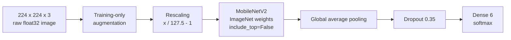

# EcoSort AI Model Card

## Summary

EcoSort AI uses MobileNetV2 transfer learning to classify a single waste photograph into one of six visual categories:

```text
0  cardboard
1  glass
2  metal
3  paper
4  plastic
5  trash
```

The canonical artifact is `backend/models/ecosort_mobilenetv2.keras`. It produces six softmax probabilities in exactly the order stored in `backend/models/class_names.json`.

This model is intended for an educational waste-sorting demonstration. It does not identify chemical composition, guarantee recyclability, or replace local disposal guidance.

## Sources of truth

| File | Information it controls |
| --- | --- |
| `training/EcoSort_Training.ipynb` | Data audit, grouped splitting, preprocessing, augmentation, architecture, and training procedure |
| `backend/models/ecosort_mobilenetv2.keras` | Executable model graph and selected trained weights |
| `backend/models/class_names.json` | Class-index order, input shape/type/range, and embedded preprocessing contract |
| `backend/models/model_metrics.json` | Dataset counts, split counts, training record, selection evidence, confusion matrix, and exact test results |

Copied values in the website or prose must be updated from these artifacts if they ever differ.

## Dataset

The model was trained on the resized TrashNet dataset obtained from a pinned original-author mirror. The downloaded archive's recorded SHA-256 is:

```text
c060e8abfe5d6de0578ca15be1ed8ad0794a865d333c3473d53d1d9ad6e38b8c
```

### Quality audit

| Audit result | Count |
| --- | ---: |
| Source images | 2,527 |
| Corrupt images excluded | 0 |
| Exact cross-label images quarantined | 6 |
| Exact cross-label groups | 3 |
| Usable images | 2,521 |
| Perceptual near-duplicate links detected | 26 |
| Multi-image duplicate groups | 26 |
| Cross-label perceptual groups | 0 |

Six exact images appeared under conflicting labels and were quarantined rather than allowing contradictory examples into evaluation. Detected duplicate groups were used as grouping information during splitting.

### Class counts

| Class | Raw | Usable |
| --- | ---: | ---: |
| Cardboard | 403 | 403 |
| Glass | 501 | 498 |
| Metal | 410 | 409 |
| Paper | 594 | 594 |
| Plastic | 482 | 480 |
| Trash | 137 | 137 |
| **Total** | **2,527** | **2,521** |

The dataset is imbalanced, especially for `trash`. That imbalance is reflected in class weighting and in the interpretation of per-class test performance.

## Leakage-aware split

The notebook used nested `StratifiedGroupKFold` with detected duplicate groups. Grouping keeps linked duplicate images within one split rather than placing copies across training and evaluation data.

| Class | Training | Validation | Test | Total usable |
| --- | ---: | ---: | ---: | ---: |
| Cardboard | 288 | 57 | 58 | 403 |
| Glass | 356 | 71 | 71 | 498 |
| Metal | 292 | 58 | 59 | 409 |
| Paper | 425 | 85 | 84 | 594 |
| Plastic | 341 | 70 | 69 | 480 |
| Trash | 98 | 19 | 20 | 137 |
| **Total** | **1,800** | **360** | **361** | **2,521** |

The test set remained excluded from candidate selection. Selection used validation loss, with validation accuracy only as a tie-breaker.

## Input and preprocessing

### Serialized model contract

| Property | Value |
| --- | --- |
| Input shape | `224 x 224 x 3` |
| Input dtype | `float32` |
| Raw input range | `[0, 255]` |
| Model preprocessing | Embedded `Rescaling`: `x / 127.5 - 1.0` |
| Internal model range | `[-1, 1]` |
| Output | Six softmax probabilities |

### Notebook path

The notebook's image path:

1. reads the encoded image;
2. calls `tf.io.decode_image(..., channels=3)`;
3. resizes to `224 x 224` with bilinear interpolation and `antialias=True`;
4. provides `float32` values in raw `[0, 255]` scale to the network;
5. relies on the model's embedded rescaling layer for MobileNetV2's `[-1, 1]` input range.

Production upload handling additionally corrects EXIF orientation and converts safely to RGB. It must preserve the same dimensions, channel ordering, interpolation behavior, dtype, raw scale, and embedded model preprocessing. Applying another MobileNetV2 normalization outside the saved model would normalize twice and is incorrect.

## Training-only augmentation

The following Keras augmentation layers were active only during training:

| Transform | Setting |
| --- | ---: |
| Random horizontal flip | horizontal |
| Random rotation | `0.05` |
| Random translation | `0.05` |
| Random zoom | `0.10` |
| Random contrast | `0.10` |

No random augmentation is applied during validation, testing, or web inference.

## Architecture



- **Backbone:** ImageNet-pretrained MobileNetV2 with its original classification head removed.
- **Pooling:** global average pooling condenses spatial feature maps.
- **Regularization:** dropout rate `0.35`.
- **Classifier:** dense layer with six softmax outputs.

MobileNetV2 was selected because it offers a practical accuracy/size/latency trade-off for deployment. This remains transfer learning; EcoSort AI did not invent MobileNetV2 or train its backbone from random initialization.

## Training strategy

Recorded training settings:

| Setting | Value |
| --- | ---: |
| Random seed | 42 |
| Batch size | 32 |
| Initial completed epochs | 25 |
| Initial learning rate | `1e-3` |
| Fine-tuning completed epochs | 12 |
| Fine-tuning learning rate | `1e-5` |
| Fine-tuned backbone extent | Last 40 layers eligible |
| Batch-normalization behavior | Frozen during fine-tuning |

### Stage 1: feature extraction

The ImageNet-pretrained MobileNetV2 backbone was frozen. The added pooling/dropout/classification head trained for 25 completed epochs with learning rate `0.001`.

### Stage 2: fine-tuning

Fine-tuning was attempted after the initial candidate satisfied the notebook's validation safeguards. The last 40 backbone layers were opened for training while batch-normalization layers remained frozen. Training continued for 12 completed epochs with a lower learning rate of `0.00001`.

### Class weights

Class weights reduced the influence of training-set imbalance:

| Class | Weight |
| --- | ---: |
| Cardboard | `1.0416666666666667` |
| Glass | `0.8426966292134831` |
| Metal | `1.0273972602739727` |
| Paper | `0.7058823529411765` |
| Plastic | `0.8797653958944281` |
| Trash | `3.061224489795918` |

The larger `trash` weight reflects its substantially smaller training support; it does not create more real examples.

## Candidate selection

| Candidate | Validation accuracy | Validation loss |
| --- | ---: | ---: |
| Initial/frozen backbone | `0.8138889074325562` | `0.5045520067214966` |
| Fine-tuned | `0.8694444298744202` | `0.4174753427505493` |

The selection criterion was lowest validation loss, with validation accuracy as a tie-breaker. The fine-tuned candidate was selected. The held-out test set was not consulted during this choice.

## Held-out test results

The test set contains 361 images. Exact aggregate results from `model_metrics.json` are:

| Metric | Exact value | Percentage |
| --- | ---: | ---: |
| Loss | `0.4476945102214813` | — |
| Accuracy | `0.850415512465374` | 85.04% |
| Macro precision | `0.8256227190345299` | 82.56% |
| Macro recall | `0.8280514797222903` | 82.81% |
| Macro F1 | `0.8259942272207406` | 82.60% |
| Weighted precision | `0.8500693487575753` | 85.01% |
| Weighted recall | `0.850415512465374` | 85.04% |
| Weighted F1 | `0.8493687824131492` | 84.94% |

### Per-class report

| Class | Precision | Recall | F1 | Support |
| --- | ---: | ---: | ---: | ---: |
| Cardboard | `0.9473684210526315` | `0.9310344827586207` | `0.9391304347826087` | 58 |
| Glass | `0.803030303030303` | `0.7464788732394366` | `0.7737226277372263` | 71 |
| Metal | `0.8208955223880597` | `0.9322033898305084` | `0.873015873015873` | 59 |
| Paper | `0.9294117647058824` | `0.9404761904761905` | `0.9349112426035503` | 84 |
| Plastic | `0.803030303030303` | `0.7681159420289855` | `0.7851851851851852` | 69 |
| Trash | `0.65` | `0.65` | `0.65` | 20 |

### Confusion matrix

Rows are true classes; columns are predictions. Both use the order `cardboard, glass, metal, paper, plastic, trash`.

| Actual \ Predicted | Cardboard | Glass | Metal | Paper | Plastic | Trash |
| --- | ---: | ---: | ---: | ---: | ---: | ---: |
| Cardboard | 54 | 0 | 0 | 2 | 0 | 2 |
| Glass | 0 | 53 | 7 | 1 | 9 | 1 |
| Metal | 0 | 2 | 55 | 1 | 1 | 0 |
| Paper | 2 | 0 | 0 | 79 | 1 | 2 |
| Plastic | 0 | 11 | 3 | 0 | 53 | 2 |
| Trash | 1 | 0 | 2 | 2 | 2 | 13 |

## Interpretation

- Cardboard and paper produced the strongest F1 scores in this test split.
- Metal recall was high (`0.9322`), while its precision was lower because some other examples were predicted as metal.
- Glass and plastic were sometimes confused with each other; 11 plastic examples were predicted as glass and nine glass examples were predicted as plastic.
- Trash had only 20 test examples and an F1 of `0.65`, the weakest class result. Its low support makes the estimate less stable and reflects the broader data imbalance.
- Aggregate accuracy is useful but cannot show these class-specific differences, which is why macro and per-class metrics are also reported.

These results measure one held-out TrashNet split. They are not a guarantee for arbitrary phone photographs.

## Production inference

The current production target is direct TensorFlow/Keras inference from the canonical `.keras` file. The model is loaded once at application startup, not once per request.

For every request the backend should verify:

- output shape is six;
- all values are finite;
- probabilities fall in `[0, 1]` within numerical tolerance;
- the returned class is the argmax in the saved class order;
- top three predictions are sorted descending;
- softmax is not applied twice.

### Confidence policy

Maximum softmax below `0.60` is marked low-confidence. The predicted class is still returned, together with a suggestion to use a clear image containing one centered waste item.

`0.60` is an operational UX heuristic. The model has not undergone probability calibration sufficient to interpret `0.60` as a verified 60% chance of correctness. The system therefore does not equate confidence with guaranteed accuracy and does not add an `unknown` training class.

### Alternative runtimes

TFLite or ONNX should be considered only if direct TensorFlow inference encounters a demonstrated hosting limitation. Any conversion must:

1. keep the Keras artifact unchanged;
2. use a reproducible conversion script;
3. compare both runtimes on several identical real images;
4. verify class-order and top-class parity;
5. quantify probability differences;
6. add a parity test; and
7. clearly identify Keras as the training artifact and the converted file only as a serving artifact.

No separately trained optimized model should be implied.

## Limitations

- Only cardboard, glass, metal, paper, plastic, and trash are represented.
- TrashNet is relatively small and class-imbalanced.
- The dataset's backgrounds, lighting, and object presentation do not cover all deployment conditions.
- Mixed-material items, such as many snack packets, may not fit one class.
- Multiple objects, background clutter, poor lighting, unusual angles, occlusion, dirt, and damage can affect predictions.
- Softmax confidence can be high even when an input differs from training data.
- Visual appearance cannot determine all recycling properties, contamination, coatings, resin codes, or hazardous contents.
- Local collection and disposal policies differ.

## Responsible use

EcoSort AI provides educational, general-purpose guidance. It must not be the sole authority for batteries, electronics, chemicals, medical waste, hazardous waste, or regulated disposal. Users should inspect labels and follow local rules.

Claims must remain factual:

- say **transfer learning**, not “built from scratch”;
- say **visual classification**, not chemical material detection;
- report the saved held-out metrics, not a rounded marketing claim such as “95% accurate”;
- distinguish model confidence from correctness;
- do not claim all plastic is recyclable;
- do not present location-specific guidance as universal.

## Reproducibility record

The saved metrics record reports:

- random seed: `42`;
- training environment: Python `3.13.15`, TensorFlow `2.20.0`;
- GPU present during the completed run;
- pinned dataset revision and archive checksum;
- exact split and class counts;
- completed epoch counts and learning rates;
- validation-based model selection;
- complete held-out test report and confusion matrix.

The training notebook and saved artifacts should be preserved. Re-running training is not required to serve or assess this completed project.
